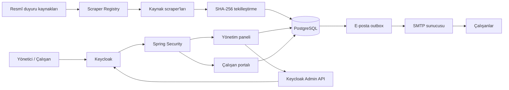

# Announcement Tracker

GİB e-Belge ve KOSGEB gibi resmî kaynaklarda yayımlanan duyuruları düzenli olarak tarayan, tekilleştiren ve ilgili çalışanlara e-posta yoluyla ulaştıran kurumsal duyuru takip uygulaması.

Uygulama; merkezi kimlik yönetimi, departman ve kaynak bazlı abonelik, yönetim paneli, çalışan portalı, kalıcı e-posta kuyruğu ve otomatik tarama zamanlayıcısını tek bir Spring Boot uygulamasında birleştirir.


## İçindekiler

- [Öne çıkan yetenekler](#öne-çıkan-yetenekler)
- [Sistem mimarisi](#sistem-mimarisi)
- [Teknoloji ve sürümler](#teknoloji-ve-sürümler)
- [Kimlik doğrulama ve yetkilendirme](#kimlik-doğrulama-ve-yetkilendirme)
- [Kurulum](#kurulum)
- [Yapılandırma](#yapılandırma)
- [Frontend geliştirme](#frontend-geliştirme)
- [Testler](#testler)
- [Yeni duyuru kaynağı ekleme](#yeni-duyuru-kaynağı-ekleme)
- [Proje yapısı](#proje-yapısı)
- [Canlı ortam notları](#canlı-ortam-notları)

## Öne çıkan yetenekler

| Alan | Açıklama |
|---|---|
| Çoklu kaynak tarama | GİB e-Belge ve KOSGEB duyuruları Jsoup tabanlı bağımsız scraper stratejileriyle taranır. |
| Duyuru tekilleştirme | Kalıcı kaynak URL'si veya normalize edilmiş duyuru bilgileri üzerinden SHA-256 kimliği üretilir. |
| Paralel tarama | Kayıtlı kaynaklar `CompletableFuture` ile eş zamanlı işlenir. |
| Dinamik zamanlama | Tarama periyodu ve zamanlayıcının aktiflik durumu yönetim panelinden değiştirilebilir. |
| Abone yönetimi | Çalışanlar tek tek veya Excel/CSV dosyasından eklenebilir; departman ve kaynak tercihleri yönetilebilir. |
| Departman modeli | Departmanlara varsayılan duyuru kaynakları atanabilir; çalışanların etkin kapsamı bu ilişkilerden hesaplanır. |
| Merkezi kimlik yönetimi | Yönetici ve çalışan girişleri Keycloak Authorization Code + PKCE akışıyla gerçekleştirilir. |
| Kullanıcı yaşam döngüsü | Abone oluşturma, güncelleme, pasifleştirme ve silme işlemleri Keycloak ile senkronize edilir. |
| Güvenli parola kurulumu | Yeni çalışanlara Keycloak tarafından imzalı ve süreli parola belirleme bağlantısı gönderilir. |
| Kalıcı e-posta outbox'ı | Teslimatlar PostgreSQL'de izlenir; geçici hatalar artan gecikmeyle yeniden denenir, kalıcı hatalar `DEAD` durumuna alınır. |
| Yönetim ve çalışan portalları | Yönetici operasyonları ile çalışanların duyuru ve tercih ekranları rol bazlı olarak ayrılır. |
| Güvenli abonelikten çıkma | İmzalı, süreli token ve CSRF doğrulamasıyla abonelikten çıkma akışı sağlanır. |

## Sistem mimarisi



Temel işlem akışı:

1. Zamanlayıcı veya yönetici talebi kaynak taramasını başlatır.
2. Her kaynak kendi scraper implementasyonu tarafından ayrıştırılır.
3. Duyurular sabit bir içerik kimliğiyle tekilleştirilerek PostgreSQL'e kaydedilir.
4. Aktif abonelerin departman ve kişisel tercihleri değerlendirilir.
5. Her duyuru–alıcı çifti için kalıcı bir outbox teslimatı oluşturulur.
6. Teslimatlar SMTP üzerinden gönderilir; başarısız işlemler kontrollü biçimde yeniden denenir.

## Teknoloji ve sürümler

| Katman | Teknoloji | Sürüm |
|---|---|---:|
| Programlama dili | Java | 21 |
| Uygulama çatısı | Spring Boot | 4.1.1 |
| Kimlik ve erişim yönetimi | Keycloak | 26.7.4 |
| Veritabanı | PostgreSQL | 17 |
| ORM ve veri erişimi | Spring Data JPA / Hibernate | Spring Boot tarafından yönetiliyor |
| Şema yönetimi | Liquibase | 5.0.3 |
| Web scraping | Jsoup | 1.18.3 |
| Excel işleme | Apache POI | 5.2.5 |
| Frontend | React (vendored) | 18.3.1 |
| UI ikonları | Lucide | Yerel vendored dağıtım |
| E2E test | Playwright Java | 1.49.0 |
| Entegrasyon testleri | Testcontainers PostgreSQL | 1.21.4 |
| Build aracı | Maven Wrapper | Proje ile birlikte |

Frontend için ayrı bir Node paket ağacı veya çalışma zamanı sunucusu kullanılmaz. React, Babel ve Lucide dosyaları uygulama kaynaklarında yerel olarak tutulur; derlenmiş tarayıcı dosyaları Spring Boot tarafından statik içerik olarak sunulur.

## Kimlik doğrulama ve yetkilendirme

Uygulama parolaları kendi veritabanında saklamaz. Parola doğrulama ve parola yenileme tamamen Keycloak tarafından yönetilir.

| Rol | Yetki alanı |
|---|---|
| `ROLE_SUPER_ADMIN` | Duyuru, abone, departman, kaynak ve sistem ayarlarının yönetimi |
| `ROLE_ADMIN` | Yönetim API'lerine erişim |
| `ROLE_SUBSCRIBER` | Çalışan portalı, kişisel tercihler ve ilgili duyurular |

Güvenlik modelinin başlıca bileşenleri:

- OAuth 2.0 / OpenID Connect Authorization Code akışı ve PKCE
- `HttpOnly`, `Secure` ve `SameSite` seçenekleriyle sunucu tarafı oturum cookie'leri
- Durum değiştiren isteklerde CSRF koruması
- Keycloak realm rollerinin Spring Security rollerine dönüştürülmesi
- Kullanıcı adı veya e-posta yerine değişmeyen Keycloak `sub` kimliğiyle hesap eşleştirme
- Backend kullanıcı yönetimi için sınırlı yetkili Keycloak servis hesabı
- Public registration, Direct Access Grant ve Implicit Flow'un kapalı olması

## Kurulum

### Gereksinimler

- JDK 21
- PostgreSQL 17
- Docker Desktop veya Docker Engine
- Git
- Frontend kaynaklarını değiştirecekseniz Node.js
- E2E testleri için Chrome, Edge veya Playwright Chromium

### 1. Projeyi klonlayın

```bash
git clone https://github.com/elifnurbeycan/announcement-tracker.git
cd announcement-tracker
```

### 2. Uygulama veritabanını oluşturun

```sql
CREATE DATABASE announcement_tracker_db;
```

Tablo ve indeksleri elle oluşturmayın. Uygulama açılırken Liquibase migration'ları otomatik olarak uygulanır; Hibernate şemayı yalnızca doğrular.

### 3. Ortam değişkenlerini hazırlayın

PowerShell:

```powershell
Copy-Item .env.example .env
```

Bash:

```bash
cp .env.example .env
```

`.env` içindeki veritabanı, SMTP ve Keycloak değerlerini kendi ortamınıza göre düzenleyin. Bu dosya gizli bilgi içerdiği için Git'e eklenmemelidir.

### 4. Yerel Keycloak ortamını başlatın

```bash
docker compose up -d
docker compose logs keycloak-config
```

Compose yapılandırması:

- Keycloak'ı `http://localhost:8180` adresinde çalıştırır.
- Keycloak için ayrı bir PostgreSQL 17 veritabanı başlatır.
- `announcement-tracker-realm` tanımını ve özel giriş temasını içe aktarır.
- Uygulama client'ını, servis hesabını, rolleri, SMTP ve yönlendirme adreslerini yapılandırır.

> Compose içindeki PostgreSQL yalnızca Keycloak verileri içindir. Uygulamanın `announcement_tracker_db` veritabanı ayrıca hazırlanmalıdır.

### 5. Uygulamayı başlatın

Windows:

```powershell
.\mvnw.cmd spring-boot:run
```

Linux/macOS:

```bash
./mvnw spring-boot:run
```

Uygulama adresleri:

| Bileşen | Adres |
|---|---|
| Uygulama girişi | `http://localhost:8080/login` |
| Keycloak yönetim konsolu | `http://localhost:8180/admin` |
| OAuth callback | `http://localhost:8080/login/oauth2/code/keycloak` |

## Yapılandırma

Temel ortam değişkenleri:

| Değişken | Amaç | Yerel varsayılan / örnek |
|---|---|---|
| `SPRING_PROFILES_ACTIVE` | Aktif Spring profili | `dev` |
| `DB_URL` | Uygulama PostgreSQL bağlantısı | `jdbc:postgresql://localhost:5432/announcement_tracker_db` |
| `DB_USERNAME` | Veritabanı kullanıcısı | `postgres` |
| `DB_PASSWORD` | Veritabanı parolası | Zorunlu secret |
| `KEYCLOAK_SERVER_URL` | Keycloak ana adresi | `http://localhost:8180` |
| `KEYCLOAK_REALM` | Uygulama realm'i | `announcement-tracker-realm` |
| `KEYCLOAK_CLIENT_ID` | Tarayıcı OIDC client'ı | `announcement-tracker-app` |
| `KEYCLOAK_ADMIN_CLIENT_ID` | Kullanıcı yönetimi servis hesabı | `announcement-tracker-admin` |
| `KEYCLOAK_ADMIN_CLIENT_SECRET` | Servis hesabı parolası | Zorunlu secret |
| `SPRING_MAIL_HOST` | SMTP sunucusu | Ortama göre değişir |
| `SPRING_MAIL_PORT` | SMTP portu | `587` |
| `SPRING_MAIL_USERNAME` | SMTP kullanıcı adı | Zorunlu secret |
| `SPRING_MAIL_PASSWORD` | SMTP parolası | Zorunlu secret |
| `MAIL_FROM` | Gönderen adresi | `noreply@example.com` |
| `APP_BASE_URL` | E-posta ve OIDC yönlendirme tabanı | `http://localhost:8080` |
| `UNSUBSCRIBE_TOKEN_SECRET` | Abonelikten çıkma token imzası | En az 32 rastgele karakter |
| `EMAIL_OUTBOX_MAX_ATTEMPTS` | Teslimat başına azami deneme | `8` |

Tüm örnek değişkenler için [.env.example](.env.example) dosyasına bakın.

## Frontend geliştirme

Tarayıcıda Babel çalıştırılmaz. `src/main/resources/static/js` altındaki JSX kaynaklarını değiştirdikten sonra dağıtım dosyalarını yeniden üretin:

```bash
node scripts/build-frontend.js
```

Çıktılar `src/main/resources/static/js/dist` altında oluşturulur ve Git'e kaynaklarla birlikte eklenir.

## Testler

Test profili H2 kullanmaz. Spring context ve repository entegrasyon testleri Testcontainers üzerinden gerçek PostgreSQL 17 üzerinde çalışır.

Windows:

```powershell
.\mvnw.cmd test
```

Linux/macOS:

```bash
./mvnw test
```

Headless E2E çalıştırma:

```bash
./mvnw -Dplaywright.headless=true test
```

Test paketi aşağıdaki alanları kapsar:

- Controller ve servis birim testleri
- Spring Security ve oturum güvenliği testleri
- PostgreSQL/Liquibase entegrasyon testi
- Scraper ayrıştırma ve tekilleştirme testleri
- Keycloak yönetim servisi testleri
- Kalıcı e-posta outbox ve yeniden deneme testleri
- Playwright yönetim paneli E2E senaryoları

## Yeni duyuru kaynağı ekleme

Scraper katmanı Strategy Pattern kullanır. Yeni bir kaynak için:

1. Kaynağı `SiteType` enum'una ekleyin.
2. `AbstractAnnouncementScraper` sınıfından türeyen bir `@Component` oluşturun.
3. `getSiteType()` ve `scrape(...)` metotlarını uygulayın.
4. Ayrıştırma ve tekilleştirme testlerini ekleyin.

```java
@Component
public class NewSourceScraper extends AbstractAnnouncementScraper {

    @Override
    public SiteType getSiteType() {
        return SiteType.NEW_SOURCE;
    }

    @Override
    public List<ScrapedAnnouncementDto> scrape(Predicate<String> hashExists) {
        Document document = fetchDocument(getSiteType().getBaseUrl());
        // Kaynağa özgü ayrıştırma ve calculateAnnouncementHash(...) kullanımı
        return List.of();
    }
}
```

`ScraperRegistry`, Spring tarafından bulunan implementasyonları otomatik kaydeder; merkezi bir `switch` bloğuna ekleme yapılması gerekmez.

## Proje yapısı

```text
src/main/java/com/yasarbilgi/announcementtracker
├── config/          Spring Security, OIDC, cookie ve oturum yapılandırması
├── controller/      REST API ve sayfa yönlendirme katmanı
├── dto/             Request, response ve session veri modelleri
├── entity/          JPA entity'leri
├── enums/           Kaynak ve teslimat durumları
├── exception/       Uygulama hata modeli
├── repository/      Spring Data JPA repository'leri
├── scheduler/       Dinamik duyuru tarama zamanlayıcısı
└── service/         İş kuralları, scraper'lar, Keycloak ve e-posta servisleri

src/main/resources
├── db/changelog/    Liquibase migration'ları
├── static/          Yönetim paneli ve çalışan portalı
├── application.yaml
├── application-dev.yaml
└── application-prod.yaml

config/keycloak/     Realm tanımı ve özel Keycloak teması
scripts/             Keycloak ve frontend yardımcı betikleri
docs/images/         README görselleri
```

## E-posta çıktısı

Bildirim e-postaları duyurunun kaynağını, tarihini, özetini, ek dosyasını, asıl kaynak bağlantısını ve güvenli abonelikten çıkma bağlantısını içerir.


## Canlı ortam notları

- `SPRING_PROFILES_ACTIVE=prod` kullanılmalıdır.
- Uygulama ve Keycloak yalnızca HTTPS üzerinden yayımlanmalıdır.
- `start-dev` yerine production Keycloak çalışma modu kullanılmalıdır.
- Parolalar ve client secret'ları `.env` yerine kurumun secret manager çözümünden sağlanmalıdır.
- Reverse proxy `Forwarded` veya `X-Forwarded-*` başlıklarını doğru aktarmalıdır.
- Keycloak redirect URI ve post-logout redirect URI değerleri tam adreslerle sınırlandırılmalıdır.
- PostgreSQL ve Keycloak için düzenli yedekleme, gözlemleme ve log saklama politikası tanımlanmalıdır.
- SMTP, Keycloak Admin API ve scraper erişimleri için zaman aşımı ve alarm mekanizmaları izlenmelidir.

Bu depo için henüz açık kaynak lisansı tanımlanmamıştır. Kullanım ve dağıtım koşulları proje sahibi tarafından belirlenmelidir.
