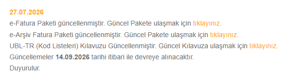

# 🔔 e-Belge Duyuru Takip ve Otomatik E-Posta Bildirim Sistemi


Gelir İdaresi Başkanlığı (GİB) ve benzeri resmi platformlardaki duyuruları otomatik olarak takip eden, yeni yayınlanan duyuruları ve ek dosyaları (PDF, ZIP paketleri) tespit edip e-posta abonelerine anında bildirim gönderen **Java 21** ve **Spring Boot** tabanlı modern bir web uygulamasıdır.

---

## ✨ Öne Çıkan Özellikler

- 🌐 **Otomatik Web Kazıma (Web Scraping)**: [e-Belge GİB](https://ebelge.gib.gov.tr/duyurular.html) portalındaki tüm duyuruları ve ek dosyalarını (ör. e-Fatura paketleri, kılavuzlar) anlık olarak tarar ve veritabanına kaydeder.
- ⏱️ **Dinamik Tarama Sıklığı (Dakika & Saat Ayarı)**: Tarama periyodunu kullanıcı arayüzünden canlı olarak değiştirebilirsiniz (ör. 15 dk, 20 dk, 30 dk, 1 saat, 24 saat veya özel girilen dakika). Ayarlar PostgreSQL veritabanında saklanır.
- 📧 **Zengin HTML E-Posta Bildirimleri**: Yeni duyuruları yüksek uyumlulukta responsive HTML e-posta şablonuyla tüm abonelere otomatik gönderir.
- 🛑 **Abonelikten Çıkma Mekanizması (Unsubscribe)**: E-postaların altında yer alan kişiselleştirilmiş bağlantı üzerinden abonelerin tek tıkla abonelikten çıkmasını veya pasife alınmasını sağlar.
- 📊 **Excel / CSV İle Toplu Abone Yükleme**: Apache POI altyapısı sayesinde şablon Excel dosyasını indirip yüzlerce aboneyi tek seferde sisteme aktarabilirsiniz.
- 🔎 **Aboneler ve Duyurular İçin Canlı Arama & Sayfalama**: Arayüzde aboneler ve duyurular üzerinde real-time filtreleme, arama ve sayfalama (pagination) imkanı.

---

## 📸 Ekran Görüntüleri

### 1. Modern Kullanıcı Arayüzü (Dashboard)


### 2. Şablon E-Posta Bildirimi


### 3. Taranan GİB Resmi Duyuru Örneği


---

## 🏗️ Mimari ve Yeni Site Ekleme Kılavuzu

Sistem **Strategy Design Pattern** ve **Spring Bean Registry** mimarisine dayanmaktadır. Yeni bir duyuru kaynağı eklemek son derece kolaydır.

```
src/main/java/com/yasarbilgi/announcementtracker/
├── controller/            # REST API Uç Noktaları (Announcements, Subscribers, Settings)
├── dto/                   # Veri Transfer Nesneleri (Request/Response)
├── entity/                # JPA Veritabanı Varlıkları (Announcement, Subscriber, SystemSetting)
├── enums/                 # Enum Tanımları (SiteType, ScrapingStatus)
├── repository/            # Spring Data JPA Depoları
├── scheduler/             # Dynamic Task Scheduler (Dinamik Tarama Periyodu)
├── service/               # İş Mantığı Servisleri
└── service/scraper/       # Web Scraping Stratejileri
    ├── AnnouncementScraper.java           # Scraper Arayüzü
    ├── AbstractAnnouncementScraper.java   # Ortak Jsoup/HTTP Fonksiyonları
    ├── ScraperRegistry.java               # Otomatik Strateji Kayıt Merkezi
    └── impl/
        └── EBelgeGibScraper.java          # e-Belge GİB Özel Scraper Uygulaması
```

### 🧩 Adım Adım Yeni Bir Site Ekleme:

1. **`SiteType.java` Enum'ına Yeni Siteyi Ekleyin**:
   ```java
   public enum SiteType {
       EBELGE_GIB("e-Belge GİB", "https://ebelge.gib.gov.tr/duyurular.html"),
       YENI_SITE("Yeni Site Adı", "https://ornek-site.gov.tr/duyurular");
       // ...
   }
   ```

2. **`impl/` Klasöründe Yeni Scraper Sınıfını Oluşturun**:
   `AbstractAnnouncementScraper` sınıfından türeterek `@Component` olarak işaretleyin:
   ```java
   @Component
   public class YeniSiteScraper extends AbstractAnnouncementScraper {

       public YeniSiteScraper(AnnouncementRepository repository) {
           super(repository);
       }

       @Override
       public SiteType getSupportedSite() {
           return SiteType.YENI_SITE;
       }

       @Override
       public List<Announcement> scrape() {
           // Jsoup ile hedef sayfayı bağlayıp duyuruları ayrıştırın
           Document doc = fetchDocument(getSupportedSite().getUrl());
           List<Announcement> announcements = new ArrayList<>();
           // ... duyuru çıkarma mantığı
           return filterAndSaveNewAnnouncements(announcements);
       }
   }
   ```
   *Sistem, `@Component` anotasyonu sayesinde yeni scraper'ı otomatik olarak algılar ve kayıt eder.*

---

## 🛠️ Teknolojiler

- **Java 21**
- **Spring Boot 3 / 4** (Spring Data JPA, Spring Mail, Spring Web, Dynamic Task Scheduler)
- **PostgreSQL 17**
- **Jsoup** (HTML Parsing & Web Scraping)
- **Apache POI (poi-ooxml 5.2.5)** (Excel / CSV İçe Aktarma & Şablon Üretimi)
- **Lombok & SLF4J**
- **Frontend**: Single Page React (Babel CDN), Lucide Icons, Vanilla CSS Design System

---

## 🚀 Kurulum ve Çalıştırma

### 1. Gereksinimler
- Java 21+
- PostgreSQL 17+

### 2. Veritabanı Oluşturma
PostgreSQL üzerinde `announcement_tracker_db` adında bir veritabanı oluşturun:
```sql
CREATE DATABASE announcement_tracker_db;
```

### 3. Yapılandırma (`application.yaml`)
`src/main/resources/application.yaml` dosyasındaki veritabanı ve e-posta ayarlarınızı düzenleyin:
```yaml
spring:
  datasource:
    url: jdbc:postgresql://localhost:5432/announcement_tracker_db
    username: postgres
    password: YOUR_PASSWORD
  mail:
    host: smtp.gmail.com
    port: 587
    username: YOUR_EMAIL@gmail.com
    password: YOUR_GMAIL_APP_PASSWORD
```

### 4. Uygulamayı Başlatma
```bash
./mvnw spring-boot:run
```
Uygulama ayağa kalktığında tarayıcınızdan **`http://localhost:8080`** adresine giderek yönetim panelini kullanabilirsiniz.

---

## 🧪 Testleri Çalıştırma

```bash
./mvnw test
```

---

## 📄 Lisans
Bu proje MIT lisansı altında lisanslanmıştır.
