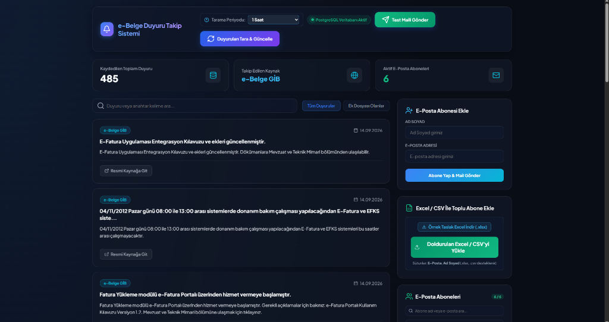
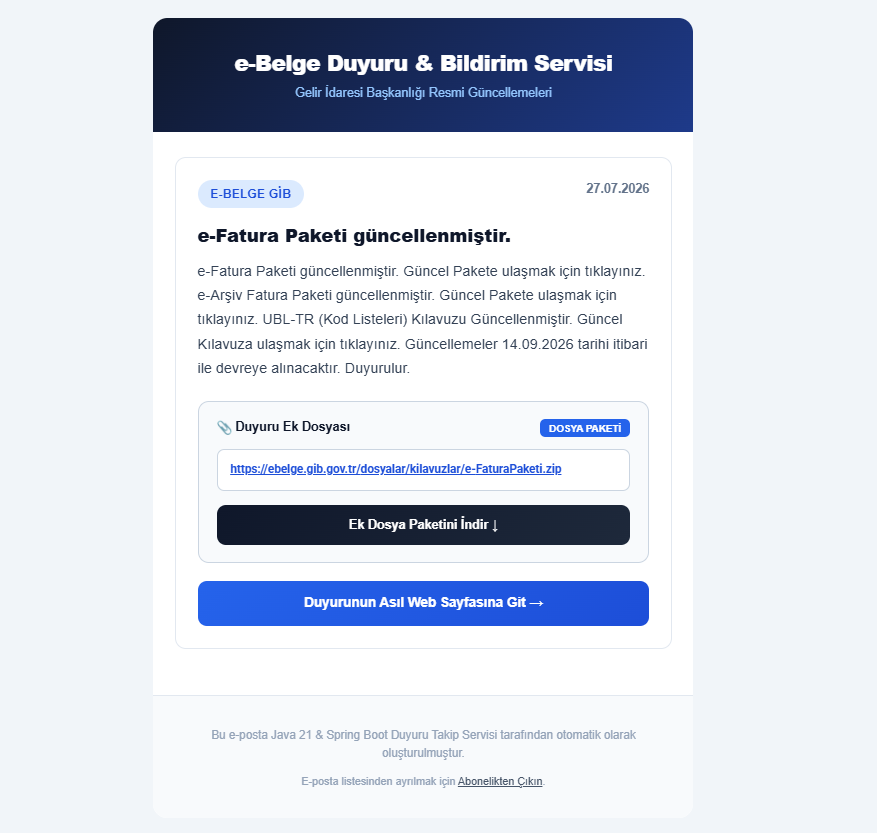

# e-Belge Duyuru Takip Servisi

Bu proje, Gelir İdaresi Başkanlığı (GİB) e-Belge portalı ve benzeri kurumsal platformlardaki resmi duyuruları otomatik olarak izleyen, veritabanına kaydeden ve yeni duyuru tespit edildiğinde e-posta abonelerine bildirim gönderen bir **Spring Boot (Java 21)** servisidir.

---

## Ekran Görüntüleri

### Yönetim Paneli


### E-Posta Bildirim Şablonu


---

## Temel İşlevler

- **Otomatik Duyuru Taraması**: GİB e-Belge duyuruları ve ek dosyaları (PDF, ZIP paketleri) belirli aralıklarla taranır ve veritabanında güncellenir.
- **Dinamik Tarama Periyodu**: Tarama sıklığı (ör. 15 dk, 20 dk, 1 saat) yönetim panelinden ayarlanabilir ve tercihler veritabanında saklanır.
- **E-Posta Bildirimleri & Abonelik Yönetimi**: Yeni duyurular HTML e-posta formatında iletilir. E-posta altbilgisinde kişiselleştirilmiş abonelikten çıkma bağlantısı yer alır.
- **Toplu Abone İçe Aktarma**: Excel (.xlsx, .csv) dosyası üzerinden toplu abone ekleme desteklenmektedir.
- **Filtreleme & Sayfalama**: Arayüz üzerinden duyurular ve aboneler listesinde arama ve sayfalama yapılabilir.

---

## Mimari ve Yeni Kaynak (Site) Ekleme

Proje **Strategy Pattern** mimarisinde kurgulanmıştır. Yeni bir duyuru kaynağı eklemek için aşağıdaki adımlar izlenir:

1. **`SiteType` Enum'ına Ekleme** (`src/main/java/com/yasarbilgi/announcementtracker/enums/SiteType.java`):
   ```java
   EBELGE_GIB("e-Belge GİB", "https://ebelge.gib.gov.tr/duyurular.html"),
   YENI_KAYNAK("Yeni Kaynak Adı", "https://ornek-site.gov.tr/duyurular");
   ```

2. **Scraper Sınıfı Oluşturma** (`src/main/java/com/yasarbilgi/announcementtracker/service/scraper/impl/`):
   `AbstractAnnouncementScraper` sınıfından türeterek `@Component` olarak tanımlayın:
   ```java
   @Component
   public class YeniKaynakScraper extends AbstractAnnouncementScraper {

       public YeniKaynakScraper(AnnouncementRepository repository) {
           super(repository);
       }

       @Override
       public SiteType getSupportedSite() {
           return SiteType.YENI_KAYNAK;
       }

       @Override
       public List<Announcement> scrape() {
           Document doc = fetchDocument(getSupportedSite().getUrl());
           List<Announcement> announcements = new ArrayList<>();
           // Ayrıştırma logic'i
           return filterAndSaveNewAnnouncements(announcements);
       }
   }
   ```
   *Spring Bean mekanizması sayesinde yeni yazılan scraper otomatik olarak algılanır.*

3. **Ön Yüz Filtre Butonu (Opsiyonel)** (`src/main/resources/static/index.html`):
   Yönetim panelindeki kaynak filtresinde yeni sitenin görünmesi için buton listesine ekleyin:
   ```html
   <button class="filter-btn" onClick={() => setSiteFilter('YENI_KAYNAK')}>Yeni Kaynak</button>
   ```

> **Not (Veritabanı Uyumluluğu):** Projedeki `DatabaseConstraintFixer` bileşeni, PostgreSQL enum kısıtlamalarını uygulama açılışında otomatik günceller; bu sayede veritabanında manuel SQL çalıştırmanız gerekmez.

---

## Kullanılan Teknolojiler

- **Java 21 & Spring Boot 3/4**
- **PostgreSQL 17 & Spring Data JPA**
- **Jsoup** (HTML Web Scraping)
- **Apache POI** (Excel / CSV Aktarımı)
- **React (Single Page UI) & Vanilla CSS**

---

## Kurulum ve Çalıştırma

### 1. Veritabanı
PostgreSQL üzerinde `announcement_tracker_db` adında veritabanı oluşturun:
```sql
CREATE DATABASE announcement_tracker_db;
```

### 2. Konfigürasyon (`src/main/resources/application.yaml`)
Veritabanı ve SMTP e-posta bilgilerinizi düzenleyin:
```yaml
spring:
  datasource:
    url: jdbc:postgresql://localhost:5432/announcement_tracker_db
    username: postgres
    password: YOUR_PASSWORD
  mail:
    host: smtp.gmail.com
    port: 587
    username: YOUR_EMAIL@gmail.com
    password: YOUR_APP_PASSWORD
```

### 3. Uygulamayı Başlatma
```bash
./mvnw spring-boot:run
```
Uygulama ayağa kalktıktan sonra `http://localhost:8080` adresinden yönetim paneline erişilebilir.

### 4. Testlerin Çalıştırılması
```bash
./mvnw test
```
